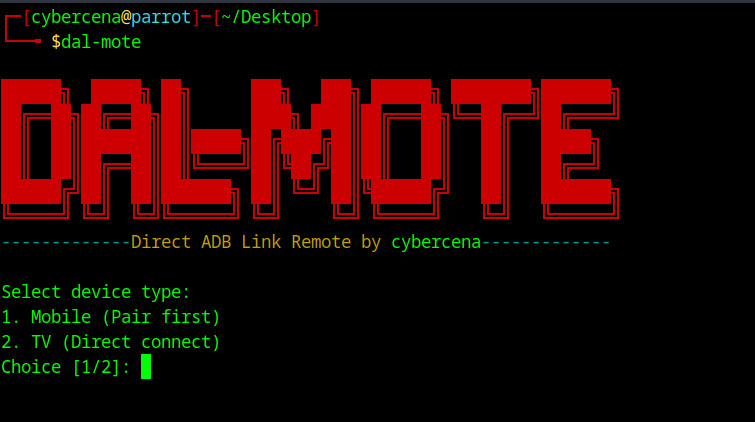

## Overview

**DAL-MOTE** is a command-line Android TV remote controller built using Bash. It acts as an interface between the user and ADB (Android Debug Bridge), allowing you to control your Android TV easily from the terminal.

---

## Installation

Follow these steps to install **DAL-MOTE**:
### Step 1: Download the `.deb` package

Get the latest `.deb` file from the [Releases](https://github.com/cybercena/DAL-MOTE/releases) section.
### Step 2: Install the package
#### ✅ If your OS has `adb` in its repository:

```bash
sudo apt install ./dal-mote_1.0.1.deb
```
#### ❌ If `adb` is not available in your OS by default:

1. Download and install ADB manually from:  
    [https://developer.android.com/tools/adb](https://developer.android.com/tools/adb)
    
2. Then install DAL-MOTE using:
```bash
sudo dpkg -i dal-mote_1.0.1.deb
```
---
### Step 3: Launch the tool
After installation, launch DAL-MOTE by running:

```bash
dal-mote
```

You’re now ready to control your Android TV from your terminal.

---
